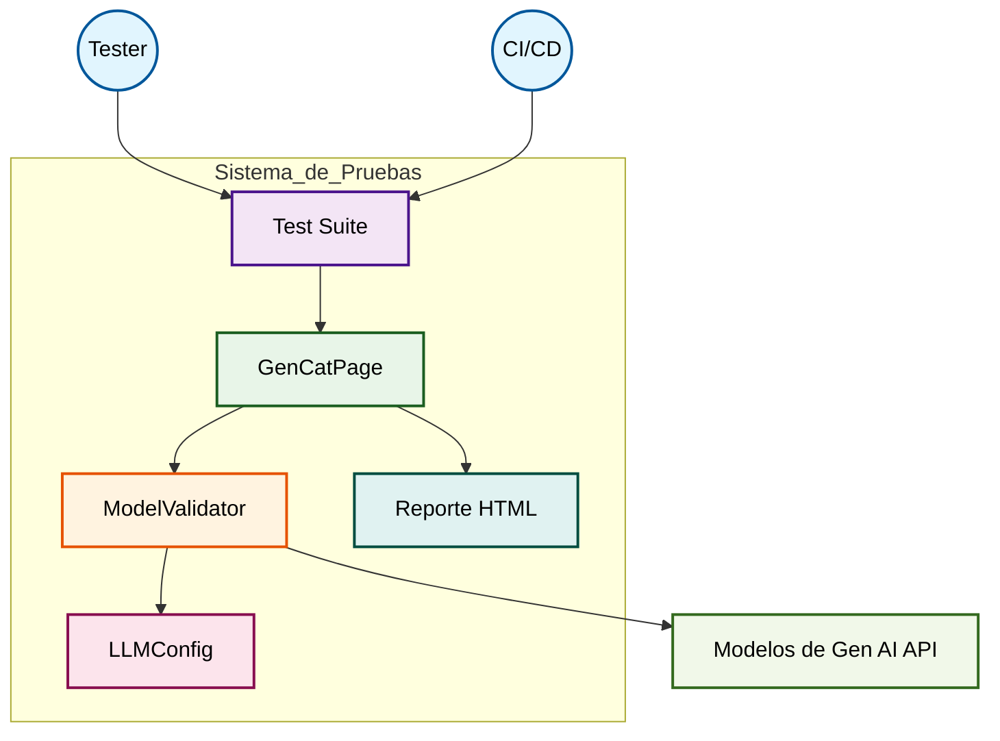
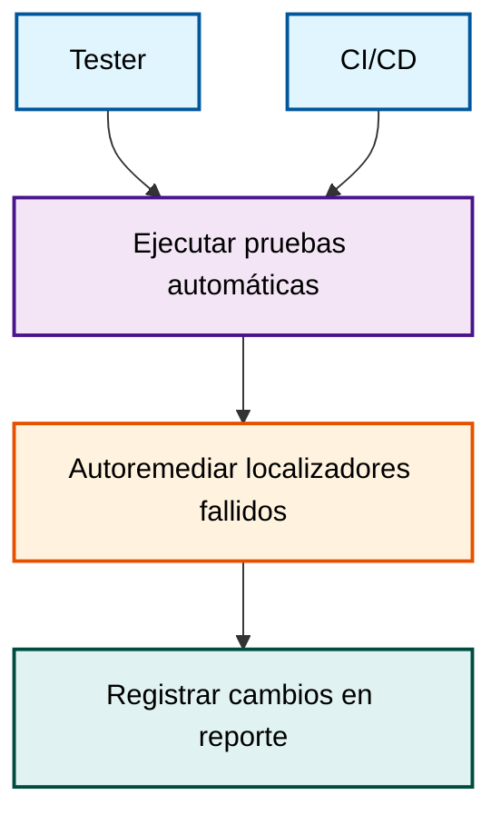
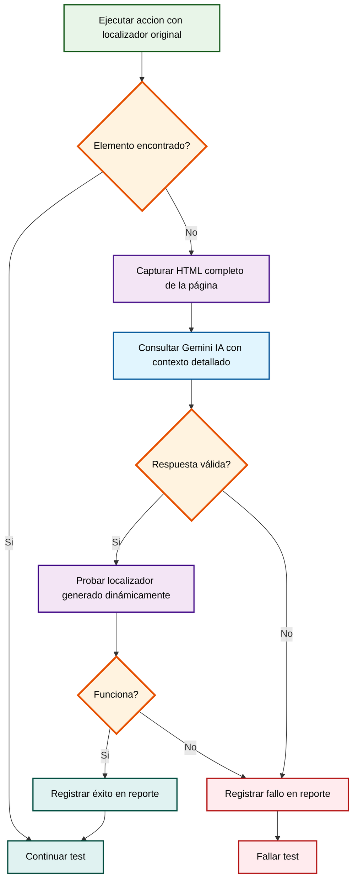
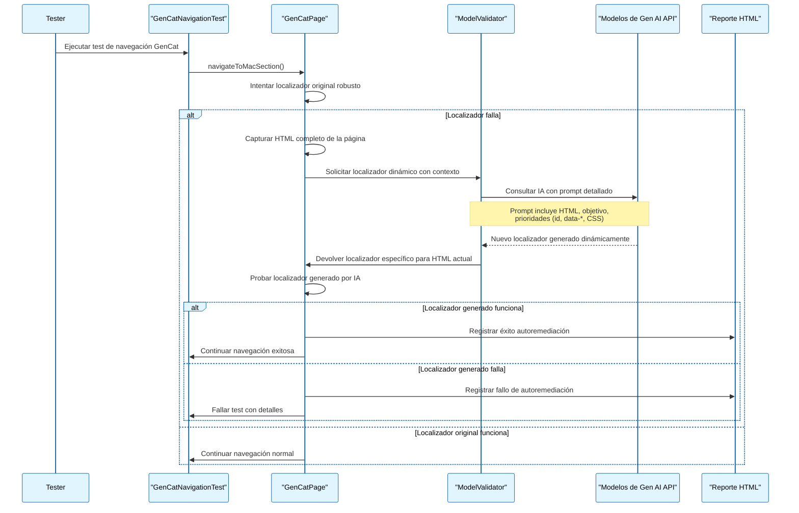

# Sistema de Autoremediación de Localizadores con Selenium Grid con modelo de Gen AI

## Descripción General
Este sistema implementa pruebas automáticas de regresión sobre aplicaciones web utilizando Selenium Grid y un mecanismo de autoremediación de localizadores basado en IA. Cuando un localizador falla, el sistema captura el HTML de la página, consulta al modelo de IA para generar localizadores dinámicamente, los prueba en tiempo real y registra los resultados en un reporte.

**Tecnologías utilizadas:**
- Selenium Grid
- Modelos de Gen AI
- Java
- TestNG
- Maven

---

**Requisitos previos:**
- Java 8+
- Maven
- Selenium Grid
- API Key del modelo de Gen AI
- Modelo de Gen AI

---

**Modelos de Gen AI Recomendados:**
- Google Gemini Pro 2.5
- OpenAI GPT-4.1
- Anthropic Claude Sonnet 4

---

# Diagramas UML y Arquitectura

A continuación se presentan los principales diagramas UML y de arquitectura en sintaxis Mermaid, para describir el funcionamiento del sistema de autoremediación de localizadores con Selenium Grid y modelos de Gen AI.

---

## 1. Diagrama de Arquitectura General



**Explicación paso a paso:**
1. El Tester o el sistema CI/CD inicia la ejecución de la suite de tests.
2. La suite de tests interactúa con los Page Objects, como `GenCatPage`, para realizar acciones sobre la UI.
3. Si un localizador falla, `GenCatPage` solicita ayuda a `ModelValidator`.
4. `ModelValidator` captura el HTML actual, consulta la configuración en `LLMConfig` y realiza una petición a los Modelos de Gen AI.
5. **CRÍTICO:** No hay localizadores alternativos predefinidos - los Modelos de Gen AI generan dinámicamente un localizador específico analizando el HTML.
6. Si se obtiene un localizador válido, se utiliza y se registra el resultado en el `Reporte HTML`.
7. Todo el flujo queda documentado para trazabilidad y análisis posterior.

---

## 2. Diagrama de Casos de Uso (Flowchart)



**Explicación paso a paso:**
1. El Tester o el sistema CI/CD puede iniciar la ejecución de pruebas automáticas.
2. Durante la ejecución, si algún localizador falla, se activa el proceso de autoremediación.
3. Cada vez que se utiliza un localizador alternativo, el sistema registra el cambio en el reporte para su trazabilidad.

---

## 3. Diagrama de Actividades: Autoremediación (Flowchart)



**Explicación paso a paso:**
1. Se intenta ejecutar una acción usando el localizador original (robusto, con múltiples estrategias).
2. Si el elemento es encontrado, el test continúa normalmente.
3. Si no se encuentra, se captura el HTML completo de la página.
4. Se consulta a Gemini IA con un prompt detallado que incluye contexto específico del elemento.
5. **IMPORTANTE:** Gemini analiza el HTML y genera un localizador completamente nuevo (no predefinido).
6. Si la respuesta es válida, se prueba el localizador generado dinámicamente.
7. Si el alternativo funciona, se registra el éxito y el test continúa.
8. Si no funciona, se registra el fallo y el test se marca como fallido.
9. Si la respuesta del LLM no es válida, también se registra el fallo y el test falla.

---

## 4. Diagrama de Secuencia: Interacción de Componentes



**Explicación paso a paso:**
1. El Tester inicia la ejecución del test de navegación en GenCat.
2. El test solicita a `GenCatPage` navegar a la sección Mac.
3. `GenCatPage` intenta localizar el elemento con el localizador original (optimizado con múltiples estrategias).
4. Si falla, captura el HTML completo y solicita a `ModelValidator` un localizador dinámico.
5. `ModelValidator` consulta a los Modelos de Gen AI con un prompt detallado que incluye contexto específico.
6. **CLAVE:** Los Modelos de Gen AI analizan el HTML actual y generan un localizador completamente nuevo, no predefinido.
7. El localizador generado se prueba en la página en tiempo real.
8. Si funciona, se registra el éxito; si no, se registra el fallo con detalles.
9. Si el localizador original funciona, el test continúa normalmente.

---

## Casos de Uso Principales

### 1. Ejecución de Pruebas Automáticas
- **Actor:** Tester, CI/CD
- **Flujo:**
  1. Se ejecutan los tests con Selenium Grid (`./launchTest.sh`).
  2. Cada acción sobre la UI utiliza localizadores definidos en el Page Object Model (POM).
  3. Si el localizador funciona, la prueba continúa normalmente.

### 2. Autoremediación de Localizadores Fallidos
- **Actor:** Sistema (automatizado)
- **Flujo:**
  1. Un localizador falla (no encuentra el elemento).
  2. El sistema captura el HTML actual de la página y la descripción del elemento.
  3. Se consulta a Google Gemini (LLM) con un prompt estructurado solicitando un localizador alternativo.
  4. El LLM responde en formato JSON con el tipo y valor del nuevo localizador y una breve explicación.
  5. El sistema prueba el localizador alternativo:
     - Si funciona, lo utiliza y registra el cambio en el reporte.
     - Si no funciona, la prueba falla y se registra el intento.

### 3. Registro y Reporte de Cambios
- **Actor:** Sistema, Tester
- **Flujo:**
  1. Cada vez que se utiliza un localizador alternativo, se registra en `target/report/index.html`:
     - Localizador original fallido
     - Localizador alternativo sugerido y explicación
     - Resultado de la acción
  2. El reporte permite trazabilidad y análisis posterior.

---

## Flujos Alternativos
- Si la API de Gemini no responde o hay error, la prueba continúa (por resiliencia) y se asume el localizador como válido (configurable).
- Si el LLM no sugiere un localizador válido, se registra el fallo y la prueba se marca como fallida.

---

## Arquitectura y Componentes Clave

- **GenCatStorePage.java**: Implementa la lógica de autoremediación en el método `tryActionWithLocator`. Centraliza el fallback y el registro en el reporte.
- **GeminiValidator.java**: Encapsula la consulta a Gemini, la gestión de caché de localizadores alternativos y la validación de localizadores. Extrae solo la traza relevante para logs y reportes.
- **LLMConfig.java**: Gestiona la configuración de la API Key y el modelo Gemini.
- **target/report/index.html**: Reporte HTML donde se documentan los cambios de localizadores y resultados de las pruebas.

---

## Formato de Comunicación con el LLM (Gemini)

- **Prompt para sugerir localizador alternativo:**
  - Incluye el HTML truncado de la página, el localizador original y una descripción del elemento.
  - Solicita respuesta en formato JSON:
    ```json
    {
      "localizadorAlternativo": {
        "tipo": "xpath|css|id|...",
        "valor": "...",
        "explicacion": "..."
      }
    }
    ```
- **Prompt para validar localizadores:**
  - Lista de localizadores y HTML.
  - Solicita respuesta en formato JSON con validez de cada localizador.

---

## Beneficios
- **Robustez:** Reduce la fragilidad de los tests ante cambios menores en la UI.
- **Trazabilidad:** Todos los cambios y sugerencias quedan documentados.
- **Automatización:** Minimiza la intervención manual para mantener los tests.
- **Escalabilidad:** Integrable en pipelines CI/CD y compatible con Selenium Grid.

## Limitaciones
- **Dependencia de la calidad del LLM:** Si el modelo no sugiere un localizador válido, la autoremediación falla.
- **Coste de API:** Uso intensivo de Gemini puede tener coste asociado.
- **Latencia:** La consulta al LLM añade segundos al tiempo de ejecución de cada test fallido.

---

## Ejemplo de Registro en el Reporte

```
Localizador original: By.xpath("//a[text()='Guies']")
Localizador alternativo sugerido: By.linkText("Guies")
Explicación: El texto del enlace es único y visible, por lo que linkText es más robusto.
Resultado: Éxito
```

---

## Recomendaciones de Uso
- Mantener actualizada la API Key y el modelo en `LLMConfig.java`.
- Revisar periódicamente el reporte para identificar patrones de fallos y mejorar los POM.
- Ajustar los prompts si se detectan respuestas poco útiles del LLM.


